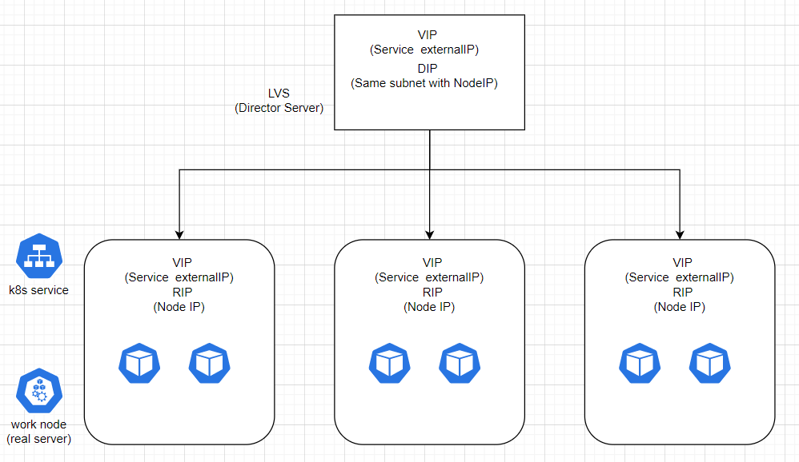

# SmartLB

Use LVS as external loadbalancer for kubernetes ingress traffic

```
apiVersion: lb.my.domain/v1
kind: SmartLB
metadata:
  name: echo-server
spec:
  service: echo-server
  namespace: default
  vip: 192.168.122.100
  scheduler: rr
```
## Pre-condition
- kube-proxy must use IPVS mode with strict ARP enabled
- Prior to v1.19 , ExternalPolicyForExternalIP must be set true if use Local mode 

## Architecture Overview


## Installation

- Compile to get the binary program, 
find the environment which have golang 1.13+ and kubectl, kustomize installed and configure with cluster

```
git clone https://github.com/JinlongWukong/smartLB.git
cd smartLB
go build  -o smartlb main.go
```

- Install CRDs to k8s cluster
```
make install 
```

- Copy the smartlb binary program to LVS server and run 

```
# need put tls certificate under/tmp/k8s-webhook-server/serving-certs/ as name tls.crt, tls.key
./smartlb --bind-interface eth0
```

```
Usage of ./smartlb:
  -auto-sync
        whether enable ipvs rules auto refresh (default true)
  -bind-interface string
        which interface the vip will bind
  -enable-leader-election
        Enable leader election for controller manager. Enabling this will ensure there is only one active controller manager.
  -enable-local-mode
        whether run this controller on lvs server (default true)
  -kubeconfig string
        Paths to a kubeconfig. Only required if out-of-cluster.
  -master --kubeconfig
        (Deprecated: switch to --kubeconfig) The address of the Kubernetes API server. Overrides any value in kubeconfig. Only required if out-of-cluster.
  -metrics-addr string
        The address the metric endpoint binds to. (default ":8081")
  -sync-period duration
        the interval of how often ipvs rules are refresh (default 1m0s)
```
## Notices
- This project has been verified on kubernetes v1.18.3

## License